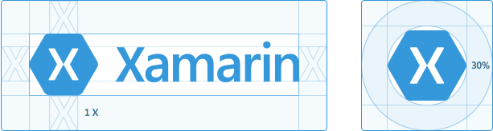

# Xamarin

## Xam·a·rin

*noun*

is an open source mobile platform enabling developers to craft beautiful cross-platform applications for iOS, Android, tvOS, watchOS, and macOS. Developers build these apps using the modern programming languages C# and F# inside of the world class IDE Visual Studio and Visual Studio for Mac. In addition, developers have the ability to share code across all .NET platforms, leverage existing libraries, and access to 100% of the native APIs.

## Logo

Here's our beloved logo and Xamagon, provided in various formats for your design needs. Please display the logo as is, without any modifications.

| Icon | PNG | SVG | PDF |
|------------|-----|------|--------|
|  | <a href="Xamarin/png/Xamarin logo.png" target="_blank" download="Xamarin logo.png">PNG</a> | <a href="Xamarin/svg/Xamarin logo.svg" target="_blank" download="Xamarin logo.svg">SVG</a> | <a href="Xamarin/pdf/Xamarin logo.pdf" target="_blank" download="Xamarin logo.pdf">PDF</a> |
|  | <a href="Xamagon/png/Xamagon.png" target="_blank" download="Xamagon.png">PNG</a> | <a href="Xamagon/svg/Xamagon.svg" target="_blank" download="Xamagon.svg">SVG</a> | <a href="Xamagon/pdf/Xamagon.pdf" target="_blank" download="Xamagon.pdf">PDF</a> |

<a href="assets/xamarin-logos.zip" class="more" download="Xamarin logos.zip">Download all versions</a>

## Spacing Considerations

Leave a healthy margin around our logo so it has room to breathe. Also, please don't combine our logo with other graphics.
   
## Colors

These are the main colors we use for Xamarin, with blue being our signature shade. The others should be used sparingly as accents.

* Blue: #3498db
* Green: #77d065
* Purple: #b455b6
* Dark Blue: #2c3e50
 
<a href="assets/xamarin-color-swatches.zip" class="more" download="Xamarin color swatches.zip">Download color swatches</a>
